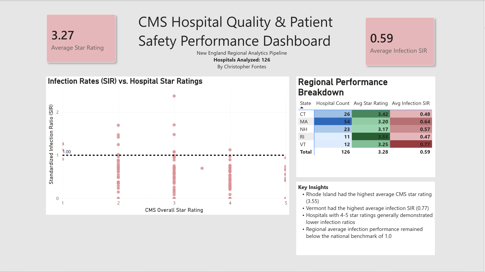

# 🏥 Automated Hospital Quality Analytics Pipeline

## Overview
## Dashboard Preview



This project demonstrates the development of an end-to-end healthcare analytics pipeline using publicly available CMS hospital quality data.

The solution automates data extraction, transformation, storage, and visualization to evaluate hospital quality and patient safety performance across New England hospitals.

Using CMS APIs, Python, PostgreSQL, and Power BI, the pipeline analyzes Healthcare-Associated Infection (HAI) metrics and CMS Star Ratings to identify regional performance trends, benchmark hospitals against national standards, and surface actionable healthcare quality insights.

---

## Business Problem

Healthcare organizations and policymakers require timely, accurate quality metrics to evaluate hospital performance and patient safety outcomes.

Manually collecting, validating, and reporting this information is time-consuming and prone to error.

This project automates the process by:

- Extracting hospital quality data directly from CMS
- Validating and transforming datasets
- Loading structured data into PostgreSQL
- Delivering executive-level reporting through Power BI

---

## Project Objectives

- Build an automated healthcare analytics pipeline using real-world CMS datasets
- Evaluate relationships between hospital quality ratings and infection performance
- Compare healthcare quality outcomes across New England states
- Create an executive dashboard that supports data-driven decision-making
- Demonstrate healthcare analytics, ETL, and business intelligence skills

---

## Technology Stack

### Data Source

- CMS Provider Data API (Socrata Open Data API)

### Data Engineering

- Python
  - Pandas
  - NumPy
  - Requests
  - SQLAlchemy

### Database

- PostgreSQL

### Visualization

- Power BI

### Analytics

- Healthcare Quality Metrics
- Healthcare-Associated Infection (HAI) Metrics
- CMS Star Ratings
- Regional Benchmarking

---

## Data Pipeline Architecture

```text
CMS API
   ↓
Python Data Extraction
   ↓
Data Cleaning & Transformation
   ↓
PostgreSQL Database
   ↓
Power BI Dashboard
   ↓
Executive Insights & Reporting
```

---

## Key Features

### Automated API Extraction

- Extracts healthcare quality data directly from CMS APIs
- Supports pagination and automated retrieval workflows
- Eliminates manual data collection

### Data Cleaning & Transformation

- Handles missing values and inconsistent records
- Standardizes hospital quality datasets
- Prepares data for downstream analysis

### Relational Database Storage

- Stores cleaned datasets within PostgreSQL
- Supports scalable querying and reporting

### Executive Dashboard Reporting

Provides interactive reporting on:

- Hospital Star Ratings
- Infection Standardized Infection Ratios (SIR)
- Regional Quality Comparisons
- Benchmark Performance Analysis

---

## Key Findings

### New England Hospital Performance Analysis

- Rhode Island achieved the highest average CMS Star Rating (3.55)
- Vermont demonstrated the highest average Infection SIR (0.77)
- Higher-rated hospitals generally exhibited lower infection ratios
- The regional average Infection SIR remained below the national benchmark of 1.0
- Analysis included **126 hospitals** across Connecticut, Massachusetts, New Hampshire, Rhode Island, and Vermont

---

## Dashboard Preview

### Executive KPIs

- Average CMS Star Rating
- Average Infection SIR

### Comparative Analysis

- Infection SIR vs. CMS Star Rating Scatter Plot
- State-Level Performance Matrix
- Hospital Count by State
- Executive Insight Summary

---

## Skills Demonstrated

### Healthcare Analytics

- Hospital Quality Analytics
- Patient Safety Metrics
- Healthcare Benchmarking
- Data Storytelling

### Data Engineering

- ETL Pipeline Development
- API Integration
- Data Validation
- Workflow Automation

### Database Management

- PostgreSQL
- Relational Data Modeling
- SQL Querying

### Business Intelligence

- Power BI Dashboard Development
- KPI Design
- Executive Reporting
- Data Visualization

### Programming

- Python
- SQL

---

## Future Enhancements

Potential future improvements include:

- National hospital quality analysis
- Additional CMS quality measures
- Historical trend analysis
- Automated cloud deployment
- Predictive healthcare quality modeling

---

## Author

**Christopher Fontes**

Healthcare Data Analyst | Business Intelligence Analyst

- [LinkedIn:](https://www.linkedin.com/in/christopher-fontes/)

---

## Project Status

✅ Complete

**CMS API → Python → PostgreSQL → Power BI**

126 hospitals analyzed across New England.
